# Principal Propagation

### Adicionar subaccount

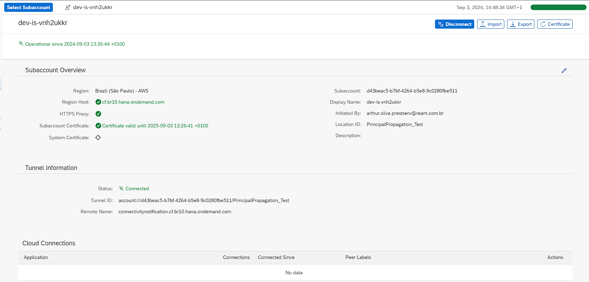

### Adicionar sistemas

- Cloud To On-Premise
  - `HTTP` e `HTTPS`

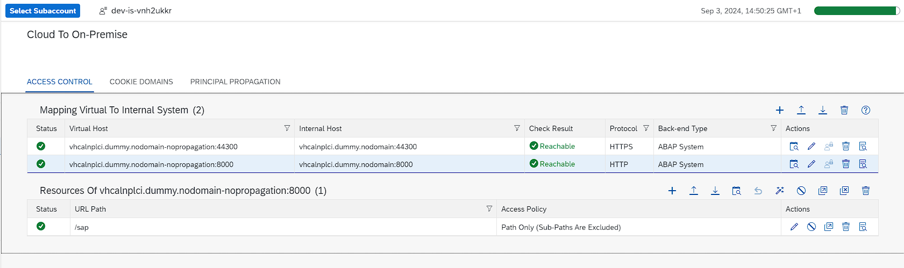

### Importar certificado .x509 do backend no Trust Store to Cloud Connector

- Double click em `SSL server Standard`
- Double click no Subject
- Clicar em exportar e guardar o certificado como `base64` sob extensão `.crt`

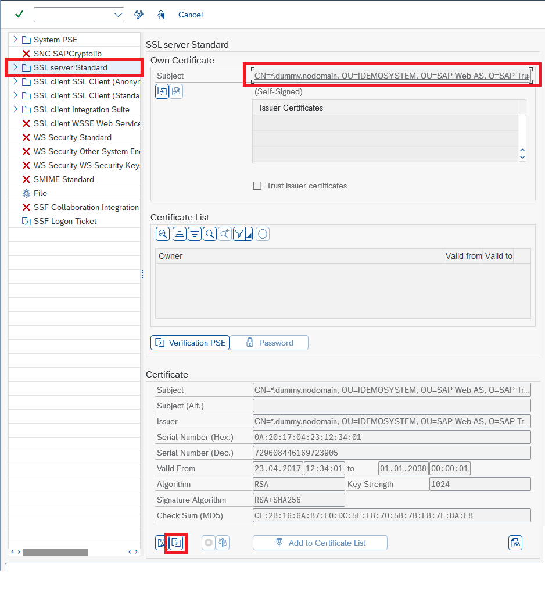

Uma vez que o certificado foi exportado do backend, o mesmo deve ser importado no Cloud Connector

> `Configuration` > `On Premise` > `Backend Trust Store` > `Allow list`

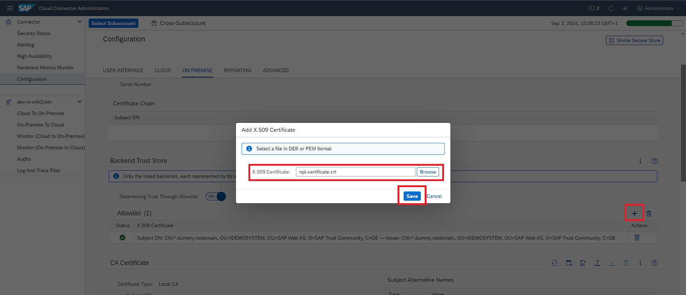

O resultado esperado é que o teste de conexão para a configuração `HTTPS` retorne como `✅ Reachable`.

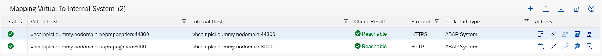

### Habilitar `Principal Propagation` para a subaccount

> `Cloud To On-Premise` > `Principal Propagation`

O Cloud Connector, por padrão, não confia em nenhuma entrada que emita tokens para o `Principal Propagation`. Por essa razão, é necessário estabelecer uma ponte segura entre o Cloud Connector e o `IDP` da subaccount.

Clicar no botão `🔄 Refresh`

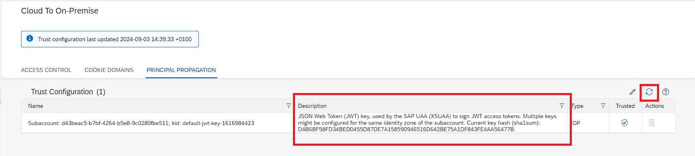

### Criar `System Certificate`

> `Configuration` > `On Premise` > `System Certificate`

A criação do `System Certificate` (certificado de sistema), permite a autenticação mútua entre o Cloud Connector e sistemas back-end ao qual ele se conecta. 

Após importar importar um certificado de cliente `X.509` no Cloud Connector, o Cloud Connector utiliza o `System Certificate` para todas as solicitações `HTTPS` a back-ends que solicitam ou exigem um certificado de cliente. 

> A Autoridade Certificadora (CA) que assinou o certificado de cliente do Cloud Connector deve ser confiável por todos os sistemas back-end aos quais o Cloud Connector deve se conectar.

Criar o `System certificate` da seguinte forma:

> utilizar o hostname do Cloud Connector em `Common Name (CN)`

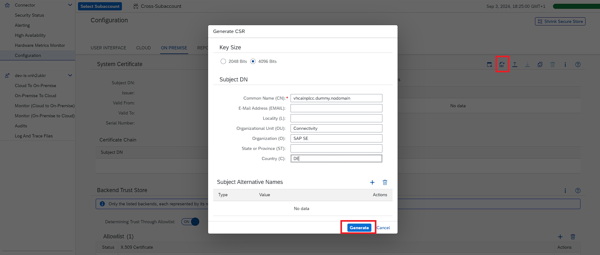

Após, exportar o certificado e importá-lo na transação `STRUST`

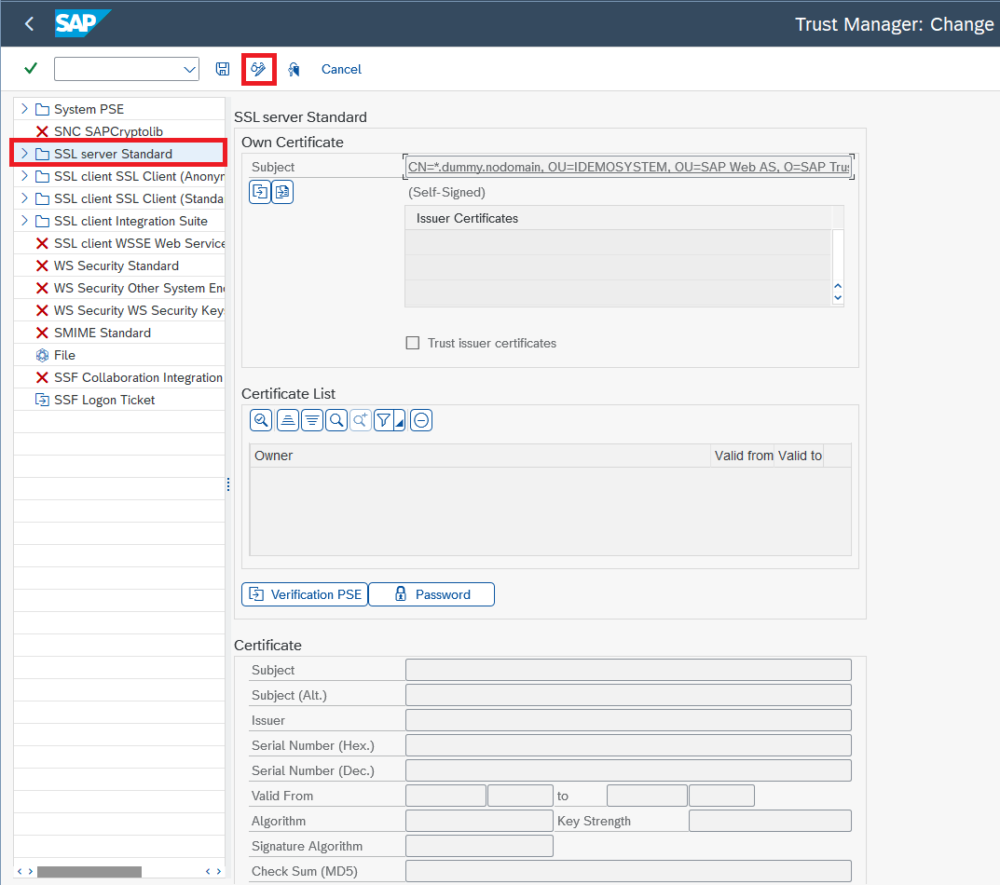

O resultado esperado é que não ocorram erros de conexão durante a verificação de disponibilidade.

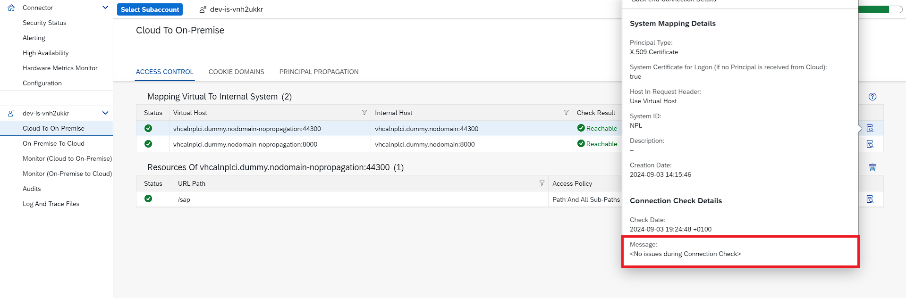

### Criar `CA Certificate`

> `Configuration` > `On Premise` > `CA Certificate`

O `CA Certificate` é utilizado para assinar todos os certificados vindos do SAP BTP. Isso significa que cada request vinda do BTP será assinada no `Cloud Connector` com esse certificado. 

Para que a conexão entre o BTP e On-Premise seja estabelecida com sucesso, o sistema backend (On-Premise) precisa confiar nesse certificado.

Criar o `CA certificate` da seguinte forma:

> utilizar o hostname do Cloud Connector em `Common Name (CN)`

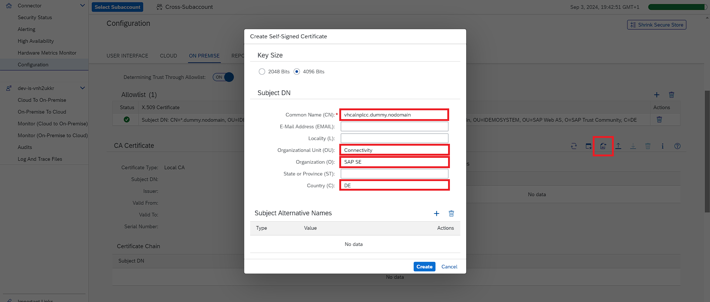

### Principal Propagation - User Certificate

> `Configuration` > `On Premise` > `Principal Propagation`

Essa etapa consiste em criar um certificado de exemplo que será utilizado no backend On-Premise.

Criar o `User Certificate` da seguinte forma:

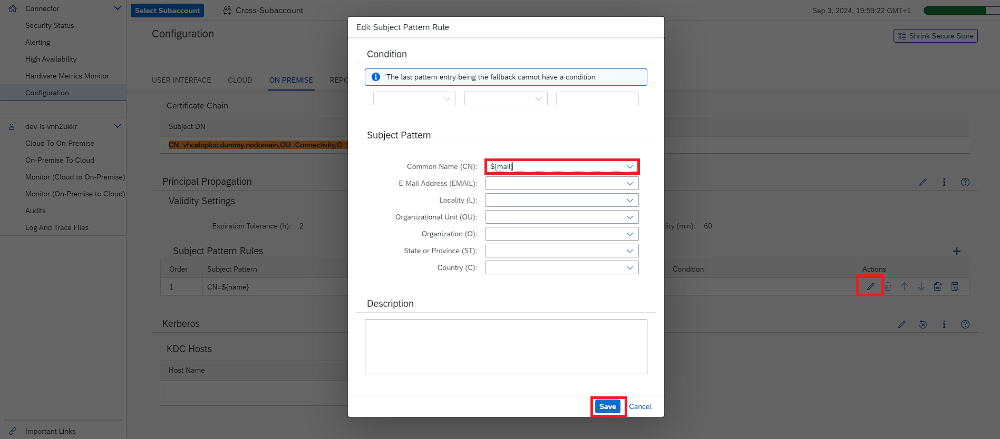

Após, crie o `sample certificate`

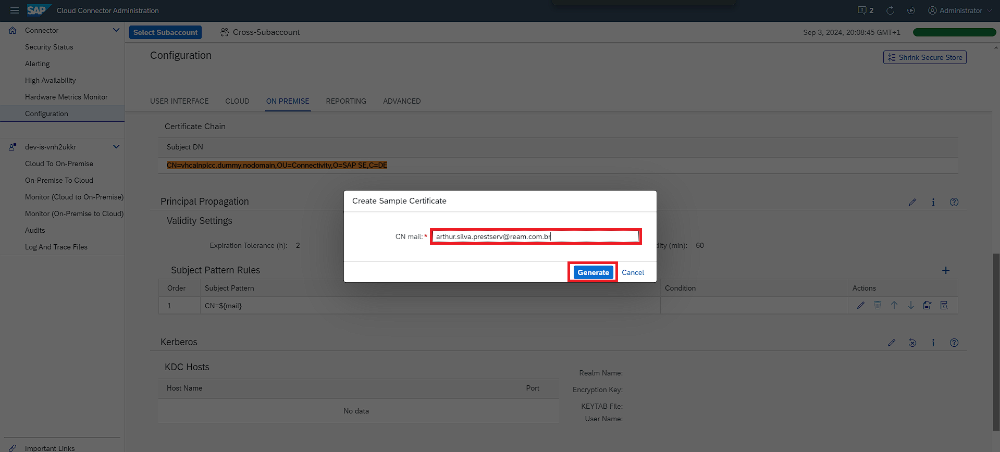

### Importar o `sample certificate` no backend On-Premise

Com o login sendo realizado utilizando o e-mail cadastrado no BTP, o endereço de e-mail será mapeado ao usuário existente na transação `SU01`

Passo abaixo consiste em importar o `sample certificate` na transação `CERTRULE`.

- Acessar a transação `CERTRULE`, e importar o certificado

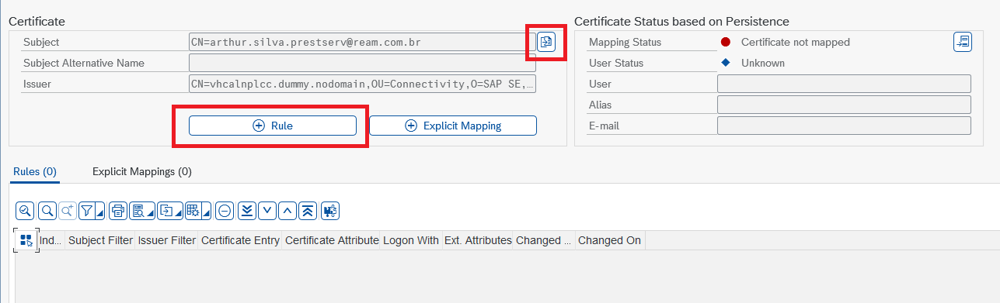

- Criar `rule` (regra)

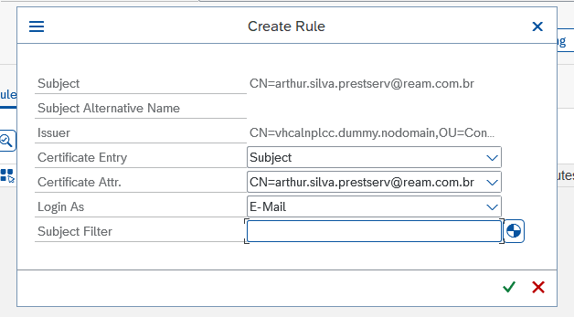

Após gravar a `rule` (regra), ambos 'Status de Mapeamento' e 'Status do Usuário' devem estar em verde.

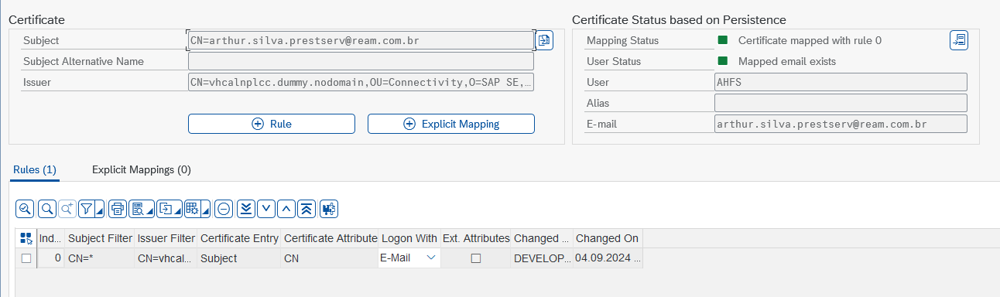

> O mapeamento é realizado com base no e-mail vinculado ao usuário na transação `SU01`.

### Definir `Subject` e `Issuer` como um paramêtro de sistema (`reverse proxy parameter`)

> Acessar a transação `RZ10` e criar o parâmetro com o auxílio de basis